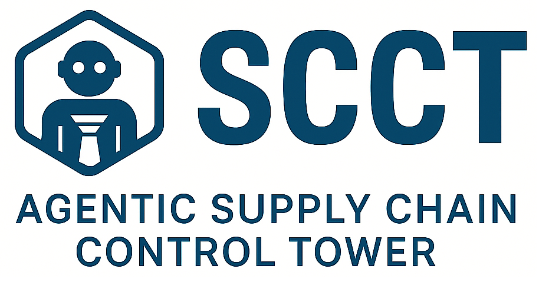
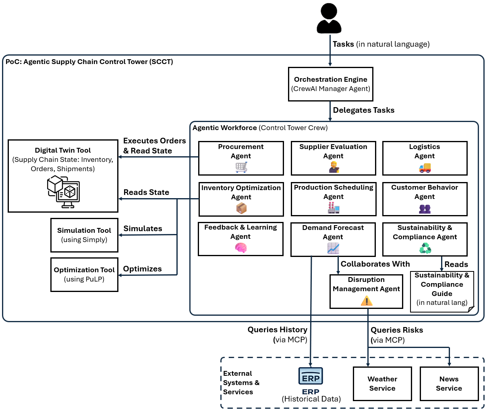

# Agentic Supply Chain Control Tower (SCCT)
**A Proof-of-Concept for Autonomous Supply Chain Management** 

---

## The Challenge: From Analysis to Action

Traditional supply chain systems can see problems, but they can't act. This creates a critical **"analysis-to-action gap"** where disruptions unfold faster than humans can respond. What if a supply chain could not only see, but also understand, reason, and act on its own?

This is the promise of an **Agentic Supply Chain Control Tower (SCCT)**, a new paradigm where a workforce of autonomous AI agents enables a truly resilient and self-healing supply chain.

## About This Repository

This repository contains the official Proof-of-Concept (PoC) implementation of the **Agentic Supply Chain Control Tower (SCCT)** framework.

The purpose of this PoC is to provide a hands-on, executable environment to validate the core hypothesis: that a workforce of autonomous AI agents can overcome classic supply chain challenges to build more resilient and efficient operations.

To achieve this, the PoC implements a multi-echelon supply chain (Factory → Distributor → Wholesaler → Retailer) within a controlled simulation environment. This testbed is based on the classic Beer Distribution Game, an academic standard renowned for demonstrating systemic failures like the bullwhip effect. This deliberate choice allows for the transparent and unambiguous validation of the framework's capabilities, isolating the direct impact of agentic intervention on system performance.

The environment is further enriched with mock external systems (ERP, Weather, and News services) to simulate the data fragmentation and external disruptions characteristic of real-world supply chains.

## Proof-of-Concept Architecture

The architecture of this PoC is a direct and faithful implementation of the Agentic SCCT framework. The diagram below illustrates the key components and their interactions, showing how a high-level task from a user is delegated to a collaborative workforce of AI agents who interact with a Digital Twin and external systems to achieve their goals.

  

## The Agentic Workforce: A Team of AI Specialists

This project uses a team of 10 specialized AI agents, orchestrated by a central manager agent. Each agent has a specific role and a curated set of tools, allowing them to collaborate effectively to solve complex tasks.

| Agent | Purpose |
| :--- | :--- |
| **📈 Demand Forecast Agent** | Forecasts short and long-term demand |
| **📦 Inventory Optimization Agent** | Optimizes safety stock and reorder points |
| **🛒 Procurement Agent** | Automates supplier selection and purchasing |
| **🧑‍⚖️ Supplier Evaluation Agent** | Assesses supplier performance and risk |
| **🏭 Production Scheduling Agent** | Allocates resources and sequences jobs |
| **🚚 Logistics Agent** | Plans and re-routes shipments |
| **👥 Customer Behavior Agent** | Analyzes customer data to predict churn |
| **⚠️ Disruption Management Agent** | Monitors risks and triggers contingency plans |
| **♻️ Sustainability & Compliance Agent** | Ensures alignment with ESG goals |
| **🧠 Feedback & Learning Agent** | Aggregates data and adjusts agent behavior |

## Technical Stack

*   **Core Language:** Python
*   **Agent Framework:** [CrewAI](https://github.com/joaomdmoura/crewAI) - A popular open-source framework for building and orchestrating autonomous AI agents.
*   **Simulation:** [SimPy](https://simpy.readthedocs.io/en/latest/) - A process-based, open-source framework for discrete-event simulation in Python.
*   **Optimization:** [PuLP](https://coin-or.github.io/pulp/) - An open-source Python library for creating and solving linear programming (LP) problems.
*   **Package & Environment Manager:** [uv](https://github.com/astral-sh/uv) - An extremely fast Python package installer and resolver, used here to manage dependencies and run scripts.
*   **Demonstration & Testing Framework:** [pytest](https://docs.pytest.org/en/stable/) - A framework that makes it easy to write small, readable tests, and can scale to support complex functional testing.
*   **External System Integration:** [Model Context Protocol (MCP)](https://modelcontextprotocol.io/docs/getting-started/intro) - A standardized protocol for AI models to interact with external tools and servers.

## Demonstrating Agentic Capabilities

This PoC provides tangible proof of the advanced capabilities enabled by the Agentic SCCT framework. These capabilities follow a logical progression of intelligence that mirrors the natural **"Sense, Act, and Reason"** workflow inherent to agentic systems, providing concrete evidence for the paper's central argument: that the Agentic SCCT framework enables a set of advanced capabilities essential for building autonomous and resilient supply chains.

### Setup
Before running the demonstrations, configure your environment variables for the Large Language Model (LLM).
1.  Rename `.env.example` to `.env`.
2.  Open the `.env` file and enter your API keys.

### Running the Demonstrations
To run a single demonstration, use the corresponding command from the table below.

---
### Category: Sense

| Capability | Description | Demonstration Details | Command to Run |
| :--- | :--- | :--- | :--- |
| **Unified Sensing & Collaborative Understanding** | The ability to autonomously synthesize internal, external, and peer-agent data to build a holistic understanding of the environment. | An agent queries the internal ERP for historical data while delegating a task to another agent to query external news and weather services. | `uv run pytest -v -s test/test_demand_forecast_task.py` |

---
### Category: Act

| Capability | Description | Demonstration Details | Command to Run |
| :--- | :--- | :--- | :--- |
| **Autonomous Action & State Modification** | The ability to independently interpret a goal and execute a transaction that modifies the state of the Digital Twin without human intervention. | The `Procurement Agent` autonomously executes a `place_order` command on the Digital Twin in response to a low-inventory goal. | `uv run pytest -v -s test/test_procurement_task.py` |
| **Governed Autonomy & Rule-Based Execution** | The ability to enforce compliance by constraining an agent's autonomous actions within a predefined, auditable workflow. | The `Sustainability & Compliance Agent` is forced by a workflow to check internal rules before approving or rejecting a proposal. | `uv run pytest -v -s test/test_sustainability_flow.py` |

---
### Category: Reason

| Capability | Description | Demonstration Details | Command to Run |
| :--- | :--- | :--- | :--- |
| **Predictive Foresight via Simulation** | The ability to proactively evaluate multiple "what-if" scenarios in a sandboxed environment to identify the most resilient strategy. | The `Inventory Optimization Agent` uses a `SimPy` tool to simulate outcomes of different policies (e.g., JIT vs. Safety-Stock) and recommends the best one. | `uv run pytest -v -s test/test_inventory_ordering_simulation_task.py` |
| **Dynamic Problem-Solving & Optimization** | The ability to reason abstractly about a unique situation and generate a bespoke, mathematically optimal solution on the fly. | The `Inventory Optimization Agent` formulates a problem description and uses a tool to dynamically generate and execute a `PuLP` optimization script. | `uv run pytest -v -s test/test_inventory_optimization_task.py` |

## Contact and Inquiries
We welcome feedback, questions, and opportunities for collaboration. Please feel free to reach out for:
*   **General Feedback:** Share your thoughts on the framework and implementation.
*   **Research Inquiries:** Discuss the academic foundations and implications of this work.
*   **Collaboration:** Explore opportunities to apply or extend this research.
*   **Technical Support:** Report issues or ask questions about the codebase.

**Contact:** `mousavi@sophia.ac.jp`