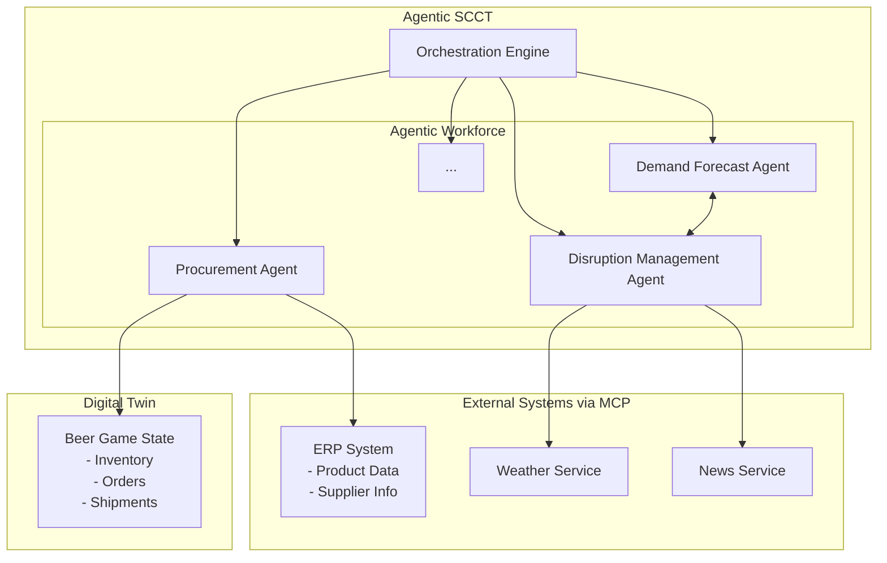

# Product Guide: Agentic SCCT for the Beer Distribution Game

## 1. Introduction: The "New Normal" in Supply Chains

Modern supply chains operate in a state of constant disruption, driven by geopolitical conflicts, extreme weather, and economic shocks. This volatility is the "new normal," forcing a shift from lean and efficient supply chains to ones that are resilient, agile, and adaptive.

## 2. The Agentic SCCT Framework

This project is a Proof-of-Concept (PoC) implementation of an **Agentic Supply Chain Control Tower (SCCT)**. This innovative framework reimagines the traditional control tower, which is a passive dashboard, as an active orchestration engine for a workforce of autonomous AI agents. The goal is to bridge the "analysis-to-action gap" by empowering AI agents to not only analyze the supply chain but also to execute decisions autonomously.

## 3. The Product: A PoC of the Beer Distribution Game

To demonstrate the capabilities of the Agentic SCCT, this project simulates the classic **Beer Distribution Game**. This game highlights the challenges of managing a supply chain with multiple independent actors and communication delays, often leading to the "bullwhip effect."

### 3.1. Supply Chain Structure

The supply chain in this PoC consists of four main stages, moving the product (beer) from production to the final customer:

1.  **Brewery (Factory):** The single production facility where beer is brewed.
2.  **Distributor:** Receives beer from the brewery and fulfills orders from the wholesaler.
3.  **Wholesaler:** Orders beer from the distributor and sells it to the retailer.
4.  **Retailer:** Orders beer from the wholesaler and sells it directly to consumers.
5.  **Customer:** The end consumer whose demand drives the entire supply chain.

### 3.2. High-Level Architecture

## 4. PoC Enhancements and Key Features

This PoC will be enhanced with several key features to provide a comprehensive demonstration for the academic paper.

### 4.1. Digital Twin of the Supply Chain

A core component of the PoC is a **Digital Twin** that represents the state of the Beer Game supply chain. This is not just a database but a dynamic model that tracks:
*   **Inventory Levels:** Real-time stock at the Brewery, Distributor, Wholesaler, and Retailer.
*   **Orders:** In-progress and historical orders between each stage.
*   **Shipments:** The status and location of beer being transported.

The Agentic Workforce interacts with this Digital Twin using a dedicated set of tools (e.g., `get_digital_twin_state`, `place_order_in_digital_twin`). The Digital Twin is the single source of truth for the *current* state of the supply chain and is the only module that can modify its own state.

### 4.2. Integration with External Systems via MCP

To simulate a realistic environment, the Agentic SCCT will connect to several mock external systems using the **Model Context Protocol (MCP)**:

*   **ERP System:** Acts as the system of record, providing product/supplier data and storing historical order and inventory information.
*   **Weather Forecast Service:** Offers weather data that can be used to predict potential logistics disruptions.
*   **News Service:** Simulates news feeds that might contain information about geopolitical or environmental risks.

### 4.3. Demonstrated Agent Capabilities

The PoC will showcase the advanced capabilities of the Agentic Workforce through specific scenarios:

*   **Historical Data Retrieval:** The **Demand Forecast Agent** will query the ERP server to retrieve historical order and inventory data from previous periods to use as a basis for its forecast.
*   **Inter-Agent Communication & External Data Integration:** The **Demand Forecast Agent** will consult the **Disruption Management Agent** before finalizing its forecast. The Disruption Management Agent will, in turn, use data from the Weather and News services to provide a risk assessment.
*   **State Recording:** At the end of each simulation period, the system will record the state of the Digital Twin into the ERP's history.
*   **Flow-Based Implementation:** The **Sustainability & Compliance Agent** will be implemented using a structured, flow-based approach (`CrewAI's Flows`). This will demonstrate how a complex, multi-step evaluation process can be reliably automated. The agent will perform a sequence of checks (e.g., sustainability, regulatory compliance) against a dedicated knowledge base (`knowledge/sustainability_guide.md`) to approve or reject proposed supply chain actions.

*   **Simulation-Based Decision Making:** The **Inventory Optimization Agent** will be equipped with a predictive simulation tool powered by the **SimPy** library. This will allow the agent to run "what-if" scenarios in a sandboxed environment, testing different ordering policies to predict their future impact on inventory levels and the bullwhip effect before making a final decision in the main Digital Twin.

*   **AI-Driven Optimization:** To showcase the highest level of agentic reasoning, the **Inventory Optimization Agent** uses a two-step process to find a mathematically optimal solution. First, the agent analyzes the business situation and **formulates a detailed, human-readable description of a linear programming problem**. Then, it passes this text description to a specialized tool that uses an AI to **dynamically generate and execute a PuLP script** to solve the problem. This demonstrates the agent's ability to reason about a problem abstractly and then create a specific, technical solution on the fly.

By implementing these features, this PoC will provide a robust and compelling demonstration of how an Agentic SCCT can create a more resilient, adaptive, and efficient supply chain.