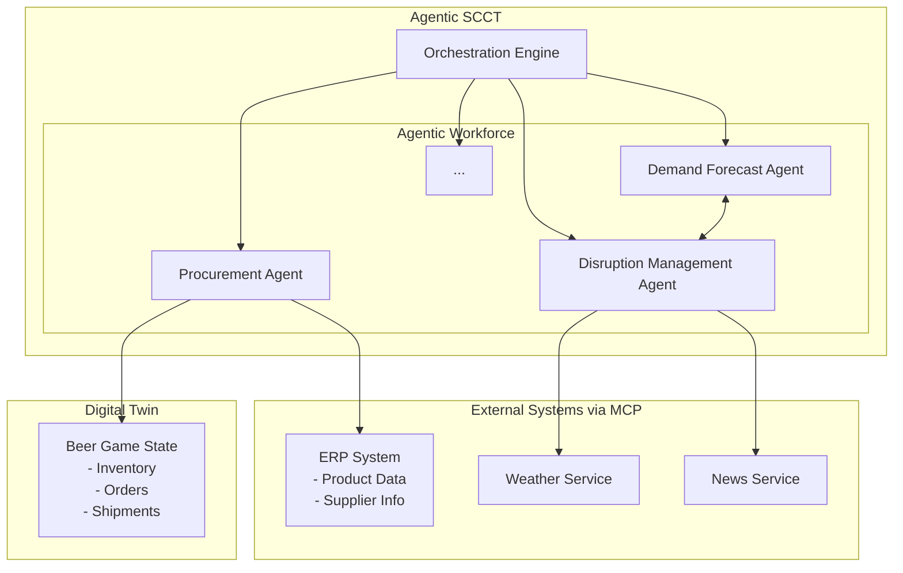
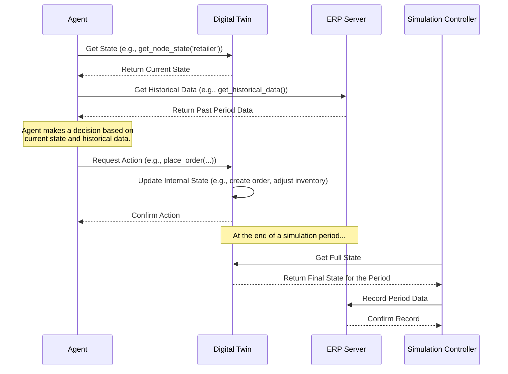
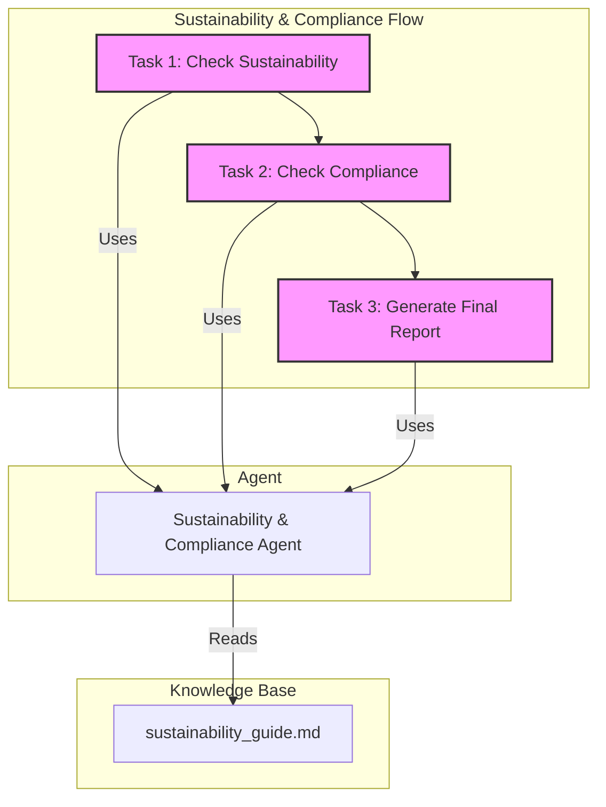
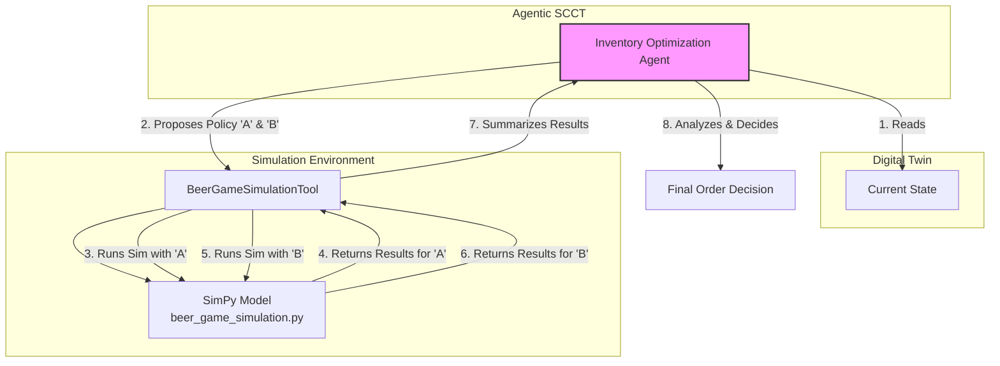
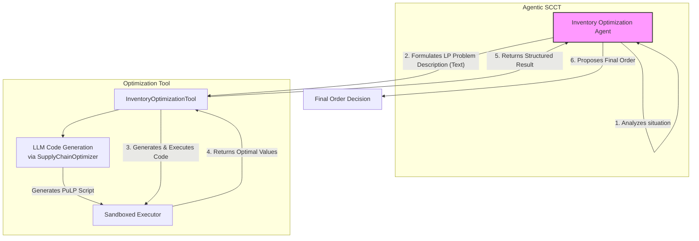

# Project Guide: Agentic SCCT PoC Implementation

## 1. Introduction

This document provides a guide to the source code and technical implementation of the Agentic Supply Chain Control Tower (SCCT) Proof-of-Concept (PoC). It details the project's architecture, framework, code structure, and configuration.

## 2. Core Framework and Technology

The project is built using the **`crewai`** framework, a powerful tool for orchestrating multi-agent systems. `crewai` allows us to define autonomous AI agents with specific roles, goals, and tools, and then assemble them into a "crew" that collaborates to solve complex tasks.

*   **Core Language:** Python
*   **Agent Framework:** `crewai`
*   **LLM Integration:** The agents' intelligence is powered by a Large Language Model (LLM), configured in `app/utils/llm_utils.py`.
*   **Simulation:** Discrete-event simulation is handled by the **`simpy`** library.
*   **Optimization:** Linear programming is handled by the **`PuLP`** library.

## 3. Enhanced PoC Architecture

The architecture of this enhanced PoC is a direct implementation of the Agentic SCCT framework, with added components to demonstrate key capabilities for the academic paper.



### 3.1. Core Components

*   **Agentic Workforce:** The specialized agents (Demand Forecast, Procurement, etc.) are defined as individual `crewai` Agents. Each agent is a self-contained unit with its own configuration, tools, and reasoning capabilities.
*   **Orchestration Engine:** The "crew" itself, defined in `app/control_tower/crew.py`, acts as the Orchestration Engine. It manages the agents and their tasks using a `hierarchical` process, where a `manager_agent` oversees the workflow.
*   **Digital Twin (Simulated):** A Python-based implementation in `app/digital_twin/` models the state of the Beer Game supply chain. It is the single source of truth for the *current* state of the simulation. Agents do not modify its state directly, but instead request changes by calling its methods (e.g., `place_order`).
*   **External Systems (MCP Servers):** The PoC includes mock implementations of an ERP, a Weather Service, and a News Service. These are implemented as **Model Context Protocol (MCP) servers** in the `app/mcp/` directory.
    *   The **ERP server** (`erp_server.py`) runs as a persistent **SSE (Server-Sent Events)** server to maintain state.
    *   The **Weather and News servers** (`weather_server.py`, `news_server.py`) run as stateless **Stdio (Standard I/O)** servers.

## 4. Code Structure

The project is organized into a modular structure to separate concerns and make it easy to extend.

```
/
├── app/                    # Main application source code
│   ├── agents/             # Definitions for each specialized agent
│   ├── config/             # YAML configuration files
│   ├── control_tower/      # Core orchestration logic
│   ├── digital_twin/       # (New) Digital Twin implementation
│   ├── flows/              # CrewAI Flow definitions
│   ├── simulations/        # SimPy simulation models
│   ├── optimizations/      # PuLP optimization models
│   ├── data_models/        # Pydantic data models
│   ├── tools/              # Custom tools for agents
│   └── utils/              # Utility functions
├── instructions/           # Markdown files with project documentation
├── knowledge/              # Knowledge base for the agents
│   ├── mcp/              # MCP server implementations
│   └── sustainability_guide.md # (New) Knowledge base for the Sustainability Agent
├── test/                   # Test scripts for the PoC
└── pyproject.toml          # Project dependencies and metadata
```

## 5. Configuration-Driven Design

The project's configuration-driven design allows for flexibility and rapid experimentation.

*   **`agents.yaml`:** Defines the persona and objectives for each agent.
*   **`tasks.yaml` and `prompts.yaml`:** Allow for easy modification of tasks and agent instructions.

## 6. Setup and Execution

This project uses `uv` for managing dependencies and `pytest` for running the PoC demonstrations.

### Running the PoC Demonstrations (Tests)

The scripts in the `/test` directory are designed to demonstrate the key capabilities of the Agentic SCCT. We use the `pytest` framework to run these demonstrations, as it provides a clean and consistent way to execute each scenario while ensuring the stability of the project.

#### One-Time Setup

First, install the project in "editable" mode along with the testing dependencies. This only needs to be done once.

```bash
uv pip install -e .[test]
```

#### Running a Specific Demonstration

To run a single demonstration and see its full output, use the `pytest` command with the `-v` (verbose) and `-s` (show prints) flags, followed by the path to the test file.

**1. Demonstrate the Digital Twin:**
```bash
uv run pytest -v -s test/test_digital_twin.py
```

**2. Demonstrate the MCP Servers:**
*Note: This test will automatically start and stop the required servers.*
```bash
uv run pytest -v -s test/test_mcp_servers.py
```

**3. Demonstrate the Demand Forecast Workflow:**
```bash
uv run pytest -v -s test/test_demand_forecast_task.py
```

**4. Demonstrate the Procurement Workflow:**
```bash
uv run pytest -v -s test/test_procurement_task.py
```

**5. Demonstrate the Sustainability Flow:**
```bash
uv run pytest -v -s test/test_sustainability_flow.py
```

**6. Demonstrate the Simulation-Based Optimization:**
```bash
uv run pytest -v -s test/test_inventory_ordering_simulation_task.py
```

**7. Demonstrate the Optimization-Based Decision Making:**
```bash
uv run pytest -v -s test/test_inventory_optimization_task.py
```

#### Running a Full System Check (Optional)

To run all demonstrations and verify that the entire system is working correctly after making changes, you can run `pytest` without specifying a file. This is useful for ensuring no regressions have been introduced.

```bash
uv run pytest -v -s
```

## 7. Data Flow and Control

The following diagram illustrates the flow of information and control between the agents, the Digital Twin, and the external systems.



## 8. Execution Flow

The application is initiated from `app/main.py`. The typical execution flow is as follows:

1.  **Initialization:** The Digital Twin, MCP servers, agents, and the `control_tower_crew` are initialized.
2.  **Task Definition:** A `Task` is defined using `crewai`, specifying the goal.
3.  **Crew Kickoff:** The `control_tower_crew.kickoff()` method is called.
4.  **Hierarchical Orchestration:** The `manager_agent` receives the task and delegates sub-tasks to the appropriate specialized agents.
    *   Agents interact with the **Digital Twin** using dedicated tools (e.g., `get_digital_twin_state`, `place_order_in_digital_twin`) defined in `app/tools/digital_twin_tools.py` to read its state and request changes.
    *   The **Demand Forecast Agent** uses the **MCP tool** to query the **ERP server** for historical data.
    *   The **Demand Forecast Agent** collaborates with the **Disruption Management Agent** to get a risk assessment.
    *   The **Sustainability & Compliance Agent** uses a structured **CrewAI Flow** to perform a multi-step evaluation of a proposed action, reading rules from a dedicated knowledge file (`knowledge/sustainability_guide.md`) to ensure the action is compliant and sustainable.
    *   The **Disruption Management Agent** uses the **MCP tool** to query the **Weather and News servers**.
    *   The **Inventory Optimization Agent** uses a **SimPy-based tool** to run "what-if" simulations on different ordering policies, allowing it to predict future inventory levels and mitigate the bullwhip effect.
        *   For the highest level of decision-making, the **Inventory Optimization Agent** can also use an **Optimization Tool**. This triggers a two-step AI process: first, the agent formulates a detailed text description of the LP problem; second, the tool uses this description to prompt an LLM to **dynamically write and execute a PuLP-based Python script** to find the optimal solution.
### 8.1. Sustainability & Compliance Flow

To provide a clear example of a structured, reliable agent process, the **Sustainability & Compliance Agent** is implemented using a **CrewAI Flow**. This ensures that its evaluation process is explicit and repeatable. The diagram below illustrates this flow:


    *   At the end of a simulation step, the system uses the **MCP tool** to record the Digital Twin's state into the **ERP server's** history.
5.  **Result:** The final output, reflecting the updated state of the Digital Twin, is returned.

### 8.2. Simulation-Based Inventory Optimization

To demonstrate advanced decision-making, the **Inventory Optimization Agent** is equipped with a predictive simulation tool. This allows the agent to test different ordering policies in a sandboxed environment and choose the one that best mitigates risks like the bullwhip effect before acting in the main Digital Twin. The diagram below illustrates this process:



### 8.3. Optimization-Based Inventory Replenishment

To demonstrate the most advanced level of agentic reasoning, the **Inventory Optimization Agent** is equipped with a tool that triggers a two-step, AI-driven process to dynamically generate and solve a linear programming model. This allows the agent to move beyond pre-defined heuristics and instead create a mathematically optimal solution tailored to the exact state of the supply chain.

